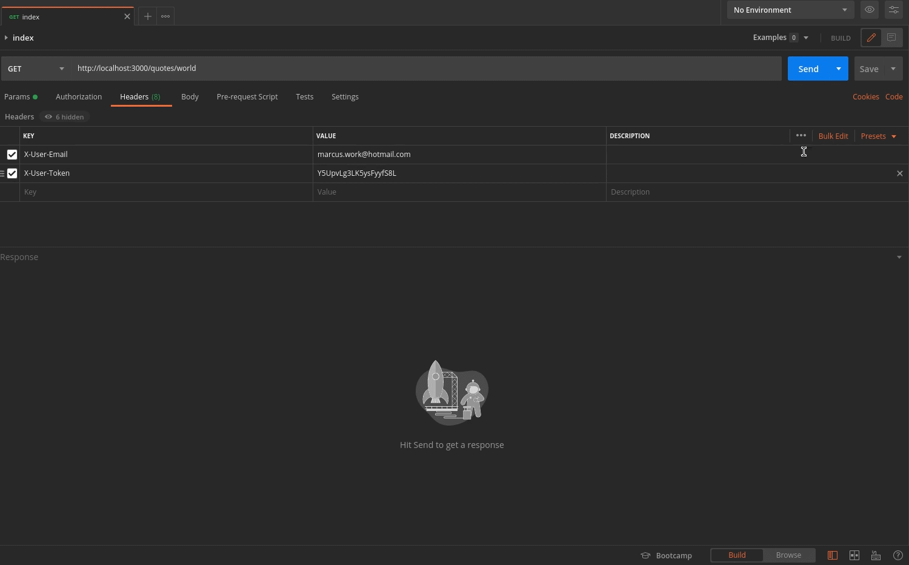
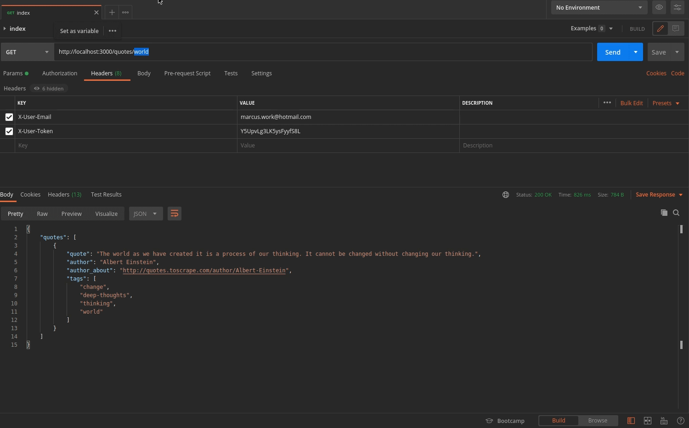
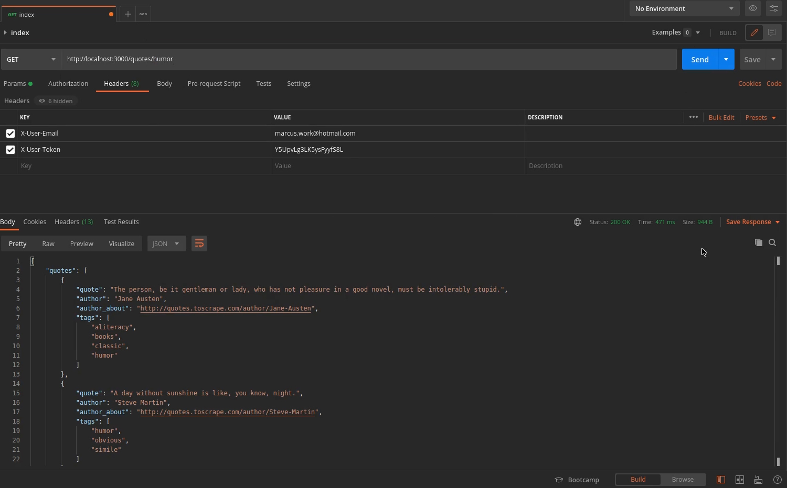
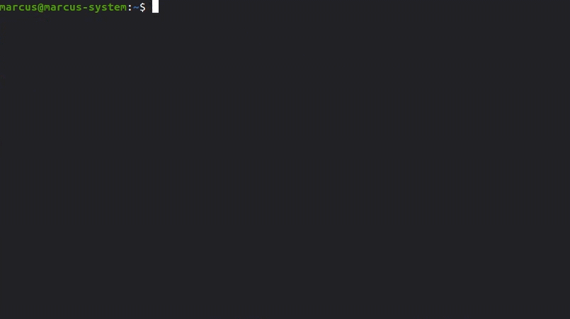
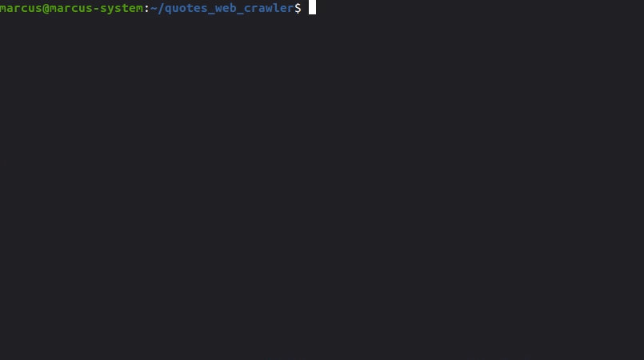
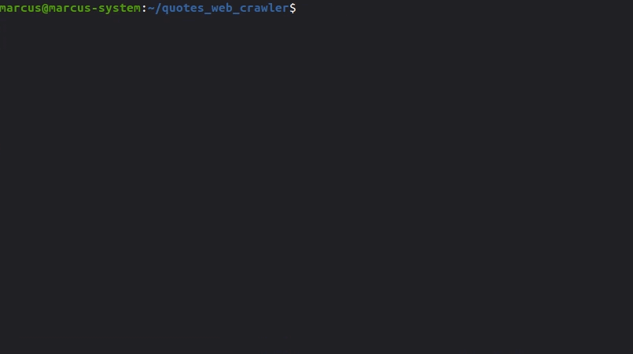
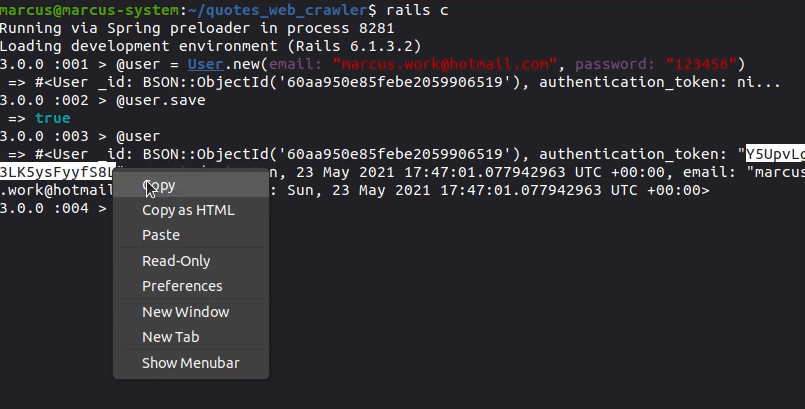
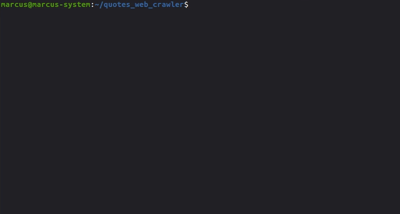

<h1 align="center">
  Quotes Web Crawler
</h1>

<p align="center">Api that returns quotes made with Ruby, Ruby On Rails and MongoDB</p>

# Content

* [Features](#features)
* [Installation](#installation)
* [Getting Started](#getting-started)
* [FAQ](#faq)
* [License](#license)
* [Authors](#authors)

</br>

#  Features

* Search phrases by tag from [Quotes to Scrape](http://quotes.toscrape.com/).
* Search phrases by tag and create when it doesn't exist
* Api access by authentication

</br>

<p align="center">
  
</p>
<p align="center">
  
</p>
<p align="center">
  
</p>

</br>

# Installation

You need Ruby and Ruby On Rails. One of the best way to do this is with [RVM](https://rvm.io/).

Now you need [GIT](https://git-scm.com/downloads) to clone this repository and then clone this project and follow the steps in order:

Clone this repository.

```
  git clone git@github.com:marcuspereiradev/quotes_web_crawler.git
```

<p align="center">
  
</p>

<br />

```
  // Install the dependencies
  bundle install
```

<p align="center">
  
</p>

<br />

# Getting Started

You need [MongoDB](https://www.postgresql.org/) database for this project.

If you have [Docker](https://docs.docker.com/get-docker/) installed in your machine, you can install a [MongoDB image](https://hub.docker.com/_/mongo).

```
sudo docker run --name some-mongo -d mongo:tag

// where some-mongo is the name you want to assign to your container and tag is the tag specifying the MongoDB version you want.
```
```
sudo docker start name-of-my-image
```

Now follow the scripts to run the application:

```
  // Create the database
  rails db:create
```

<p align="center">
  
</p>

<br />

```
  // Start the application
  rails s
```

<p align="center">
  
</p>

<br/>

To test a search of a quote with a tag you need to be authenticated, for this you need to create an user in rails console and copy authentication token.

<p align="center">
  
</p>

</br>

You need to pass the email and token to the headers as [simple_token_authentication](https://github.com/gonzalo-bulnes/simple_token_authentication) says.

<p align="center">
  
</p>

</br>

Now you be able to search a quote by tag. you can find this tags in [Quotes to Scrape](http://quotes.toscrape.com/).

<p align="center">
  
</p>

</br>

To run some test with [Rspec](https://github.com/rspec/rspec-rails)
```
// run tests
rspec
```

<p align="center">
  
</p>

</br>

# Faq

**Question:** What are the technologies used in this project?

**Answer:** The tecnologies used in this project are [Ruby](https://www.ruby-lang.org/pt/) and [Ruby On Rails Web Application Framework](https://rubyonrails.org/) to follow the [MVC](https://en.wikipedia.org/wiki/Model%E2%80%93view%E2%80%93controller) architectural pattern, [Nokogiri](https://nokogiri.org/) to parse HTML, [MongoDB](https://www.mongodb.com/cloud/atlas/lp/try2?utm_source=google&utm_campaign=gs_americas_brazil_search_core_brand_atlas_desktop&utm_term=mongodb&utm_medium=cpc_paid_search&utm_ad=e&utm_ad_campaign_id=12212624308&gclid=CjwKCAjw-qeFBhAsEiwA2G7Nl7iPtvENrlLt0CofVqEwowrmzxRoype0DiIeWgFcLQBjEsGEMhbofhoC_GwQAvD_BwE) database to persist the data and [Rspec](https://github.com/rspec/rspec-rails) to make tests.

</br>

# License
This project is under MIT license. See the archive [LICENSE](LICENSE) to more details.

</br>

# Authors

|  [Marcus Pereira](https://github.com/marcuspereiradev)   |
